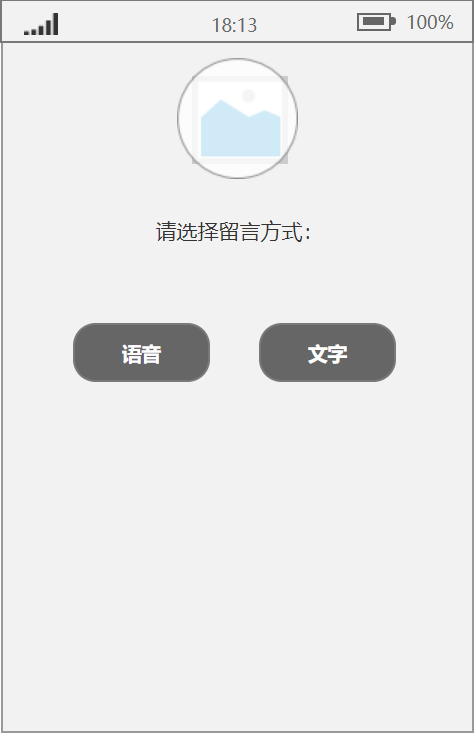
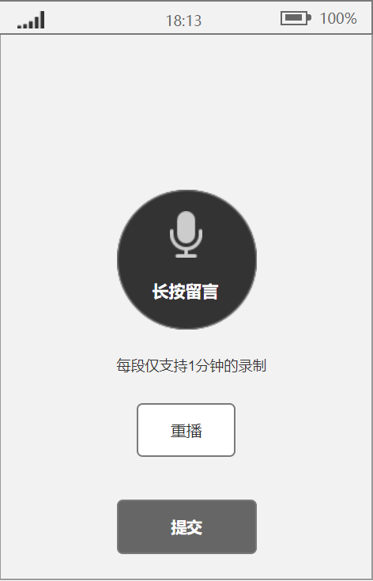
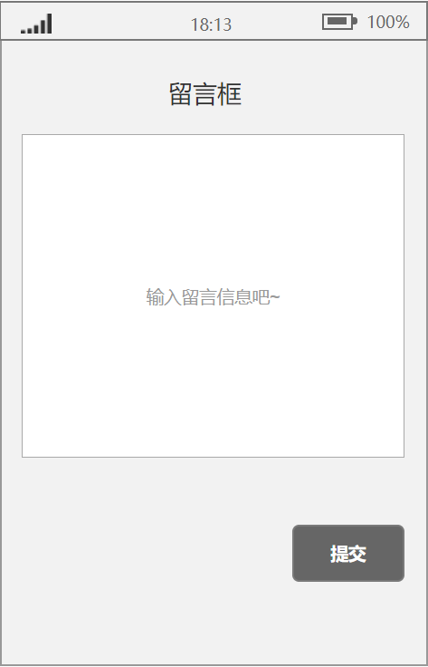
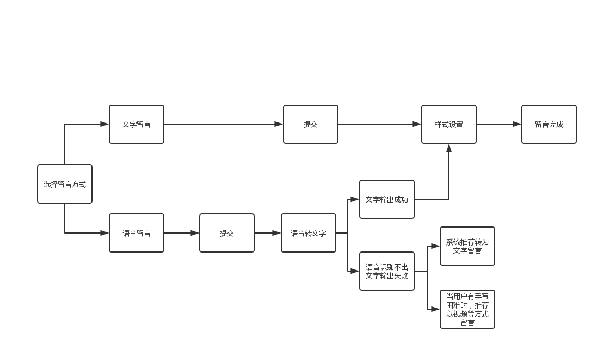

# 智能毕业纪念册

## 一、PRD价值主张设计

### PRD1.加值宣言

- 通过 **语音识别** 实现除手写以外拓展语音转文字的便利留言功能

>**一句话**：以智能代替纸质，以更生动灵活的功能样式代替纸质纪念册中固定款式，以在写字的基础上增加口述或打字等多样方式满足用户。

>**一分钟**：本产品旨在智能化地记载着几年的青春回忆。随着数字技术和时代的发展，一个接着一个地撰写、花费时间长且过后难以保管等等不便利的情况使人们望而却步，越来越少的人会专注于毕业纪念册。因此计划在用户留言时提供更便捷的帮助。例如语音识别帮助不喜欢写字等困难群体将语音转述为文字记录在纪念册中；增添各型各色的视觉效果，最大达到用户个性化设置；图像识别与图像搜索结合帮助用户图片分类汇总，按地点、时间或是动作等等。

### 产品主要概述总结

#### 产品概述

该智能毕业纪念App是契合互联网时代下智能记录与保存懵懂岁月痕迹的一款具有纪念意义的App。在推陈出新的观念下，以智能代替纸质，以更生动灵活的功能样式代替纸质纪念册中固定款式，以在写字的基础上增加口述或打字等多样方式，增加视频、GIF等多种多样的方式记载回忆、共享现况。在此App中，不仅会设置以用户为本的原型，以便利用户为主要目的，还会通过与API的结合打造智能、多样的功能。

#### 产品背景

毕业纪念册是用于记录身边同学的信息以及对纪念册主人的看法、祝福，是毕业以后留念作用的物品，记载着几年的青春回忆。随着数字技术和时代的发展，一个接着一个地撰写、花费时间长且过后难以保管等等不便利的情况使人们望而却步，越来越少的人会专注于毕业纪念册。

### PRD2.核心价值

1.  API功能在用户留言时提供更便捷的帮助。例如语音识别帮助不喜欢写字等困难群体将语音转述为文字记录在纪念册中
2.  增添视觉效果，不管是记录的用户还是纪念册主人都能在此app中发现动态、美观或是有特色的视觉冲击。产品会提供自定义设置功能，以达到用户喜欢且想要传达的效果
3.  图像识别与图像搜索结合帮助用户分类，按地点、时间或是动作等等汇总。
4.  此app还会在原有功能的基础上增加收费模块，用户可以通过选择付费项目来设置更多不同的api功能，以达到独特的记录效果

### PRD3.核心价值&用户痛点

1.  增添视觉效果需要的步骤对于某些群体来说过于繁琐。
- 特别是有一定年纪的人群，他们在没有一定技术操作的前提下会更倾向于简约派。可他们也希望在别人的纪念册中留下具有自己色彩的一页，这就需要设计者考量是否增加一键化功能便于怕麻烦或不太懂操作的人群使用。

2.  当用户遇到一项收费模块时可能会误以为整个纪念册都是需要收费的，因此放弃使用。
- 许多用户一开始使用一款新应用时都是抱着尝试的心态，若一个收费模块就令许多用户望而却步的话，这不会吸引更多的新用户。需要标注清楚哪些是免费哪些是收费的。

3.  用户总是想一连串地回忆往事。
- 通过图像识别与图像搜索来将用户所上传的图像进行识别分类，易于纪念册拥有者在浏览某一张图片时会有相关联的图像推荐弹出。

4.  通过自然语言处理的API，可帮助用户内容搜索、内容推荐等汇总功能

### PRD4.人工智能概率性与用户痛点

1.  语音识别有可能识别不到某些方言、中英混说或口音的特定字词及专有名词。
- 在语音识别不出用户说的某个字词时，通过机器学习提升准确识别度，根据情境匹配文字。例如，语音：一个“南”人--->根据日常用语得到文字：一个“男”人。
   * _如何解决？_

     当语音识别不出用户说的一句完整的话时，系统推荐用户采用语音留言的方式放在纪念册中。

2. 语音识别受用户说话方式、说话环境的干扰导致得出的结果可能不准确。
- 用户对着设备说话时难免会用喷麦、吞音等状况出现，除此之外，用户语速也是一个问题；说话环境例如声音由近至远或是由远至近，又或是嘈杂的环境等不确定因素。在这些情况下语音识别api有可能匹配不了相对应的结果。
   * _如何解决？_

     在需要用户再录一次时显示“在一个较为稳定舒适的环境下效果更佳哦~”、“距离麦远/近一点效果会更好”之类的提示语用语用于提醒。

- 这是一篇关于各家语音识别率的对比文章[谷歌、微软、讯飞的语音识别引擎对比](https://blog.csdn.net/yylsheng/article/details/8364487)作者在里面测试并得出精准率的结果，最后对三家语音识别作出总结性评价。

3.  人脸识别有机率不能将同一张人脸归类或不能将同一个人不同时期的照片识别归类出来。
- 人脸识别可检测并比较人脸；基于相似度将图像组织成组；识别图像中先前标记的人物。结合人脸识别API功能对产品实现当以后看回纪念册时以防忘记照片中人物的个人信息的功能。例如智能云相册就能提供影像文件存储、管理以及支持影像内容进行分类打标、面孔识别等智能分析，并提供基于自然语言理解的智能搜索服务。

### PRD5.需求列表与人工智能API加值

| Behavior                       | Issue                            | API      |
| ------------------------------ | -------------------------------- | -------- |
| 用户口述将语音转化为文字       | 口音重、方言、中英混说           | 语音识别 |
| 基于相似度将图像组织成组       | 不能将所有图像中的同一张人脸归类 | 图像识别 |
| 识别图像中用户已标记的人物成组 | 人物基于时间的变化               | 人脸识别 |

### 效益成本分析

#### 成本分析

- 软硬件支出：调用API所需要支付的费用；用户信息、留言者上传的文字语音图像视频等存储在云端的费用
- 人力成本：运维APP雇用人员的费用

#### 效益分析

- 通过提高视觉效果帮助使用者更真切的表达想法，提高用户体验、满足视觉享受
- 吸纳更多的用户拾起纪念册的回忆并重新使用，通过智能纪念册开创良好的口碑，提高app知名度
- 完善更多的功能，拉开与竞品的竞争力

#### 效益预测

- 开设几个需付费的模块。例如自动生成视频或实时共享等模块
- 自定义主题。用户想要与众不同的留言模板时可付费自定义定制

## 二、原型

### 原型1.交互及界面设计

1. 首页：用户进入毕业纪念册后可在此页面选择基础留言方式，语音留言或文字留言。

2. 语音留言：用户选择语音留言可免除手打字的困扰，系统会自动将语音转化成文字。

3. 语音识别：此页面是用户在使用语音留言提交后跳转的页面。

4. 文字留言：此页面与纸质版纪念册手写留言相似之处。

### 原型2.信息设计

- API运作流程图

### 原型3.原型文档

- [产品原型交互](http://nfunm071.gitee.io/api_final)

## 三、API 产品使用关键AI或机器学习之API的输出入展示

### API1.使用水平

- [jupyter代码对比文件](https://github.com/voyzze/API_ML_AI_album/blob/master/API_ML_AI_album.ipynb)里面含有百度和阿里语音识别详细操作代码，还有百度人脸识别使用代码。

| 输入                       | 输出                            | API      |
| ------------------------------ | -------------------------------- | -------- |
| 用户口述音频      | 用户口述内容           | 百度语音识别 |
| 用户口述音频       | 用户口述内容          | 阿里语音识别 |
| 识别图像中的人物   | 人物的基本信息           | 百度人脸识别 |
| 识别图像中的人物   | 人物的基本信息           | 微软人脸识别 |

### API2.使用比较分析

- [百度、阿里语音识别率测评](https://blog.csdn.net/thinktothings/article/details/97886877)

| 公司 | API             | 调用限制                 |
| ---- | --------------- | ------------------------ |
| 百度 | 百度人脸检测API | 每天一个账号500次API调用 |
| 微软 | 人脸识别API     | 无限制                   |

**百度**：检测图中的人脸，并为人脸标记出边框，准确识别多种人脸属性，如性别，年龄，表情等信息。该技术可适应大角度侧脸，遮挡，模糊，表情变化等各种实际环境。
 
 *应用场景*：智能相册分类
  
**微软**：验证、查找相似、成组

*某些人脸会因技术难题而识别不到*：
具有极端照明（例如严重的背光）的图像。
有障碍物挡住了一只或两只眼睛。
发型或胡须的差异。
年龄使面貌发生变化。
极端的面部表情。

- 通过语音识别的识别率、计费方式、限制等对比得出百度语音识别API会更适合此次纪念册的语音识别调用。通过人脸识别的限制、可能得出的结果得出微软人脸识别API会更符合此次纪念册人脸识别的调用。

### API3.使用后风险报告

| 类别     | 现在                                                           | 未来                                                     |
| -------- | -------------------------------------------------------------- | -------------------------------------------------------- |
| 语音识别 | 非特定人语音识别系统识别精度已经大于98％，已满足通常应用的要求 | 语音识别系统的应用将更加语音识别系统的应用将更加广泛广泛 |
| 人脸识别 | 人脸识别技术在更多的领域解锁了更多应用                         | 基于大数据领域的重要发展方向                             |

- 语音识别和人脸识别都是目前大数据时代下的技术分支，在人工智能和机器学习中的占比较大，发展前景良好。

| 类别     | 选用公司 | 竞争者           | 输入输出限制              | 定价       |
| -------- | -------- | ---------------- | ------------------------- | ---------- |
| 语音识别 | 百度     | 讯飞、腾讯、阿里 | 调用量无限制，2-10QPS限额 | 可免费使用 |
| 人脸识别 | 微软     | 百度、阿里       | 每个月30,000个免费事务    | 可免费使用 |

- 总体而言，无论是语音识别还是人脸识别依靠的数据库都较为地庞大，开发对于公司来说比较困难，限制的因素过多。
